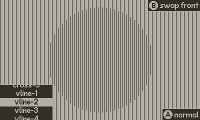

# GFXP Viewer

### About
GFXP Viewer is a fork of [GFXP](https://github.com/ivansergeev/gfxp), and is used to view a large selection of dither styles directly on the Playdate device. Get the .PDX directly ([GFXP-Viewer.pdx.zip](https://github.com/fosterdouglas/gfxp-viewer/releases/download/v2.0-viewer/GFXP-Viewer.pdx.zip)) and sideload it to your Playdate, or clone this repo and run the project yourself. :)

### Controls

D-pad up/down or *crank* - Cycle forward and back through dither options

D-pad Left button - Show or hide the dither options list

A button - Swap between normal dither and inverted

B button - Swap display modes between Circle, Fill, Swap Front, and Swap Back

Menu button - Options to hide all UI and to invert the UI color

 
### Credits

Full credit for the original [GFXP](https://github.com/ivansergeev/gfxp) tool goes to Ivan Sergeev. This is simply a convenience viewing tool for use on the Playdate device.

### License

The MIT License (MIT)

### Trademarks

[Playdate](https://play.date/) is a trademark of [Panic](https://panic.com/)